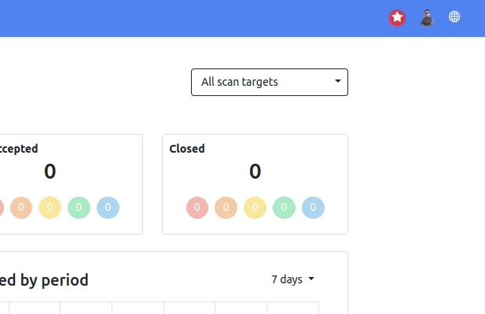
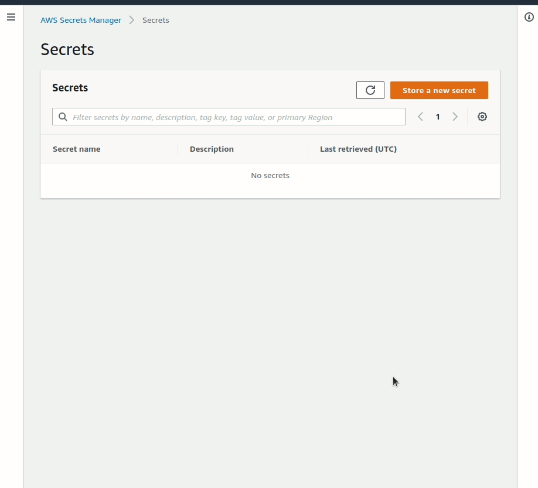
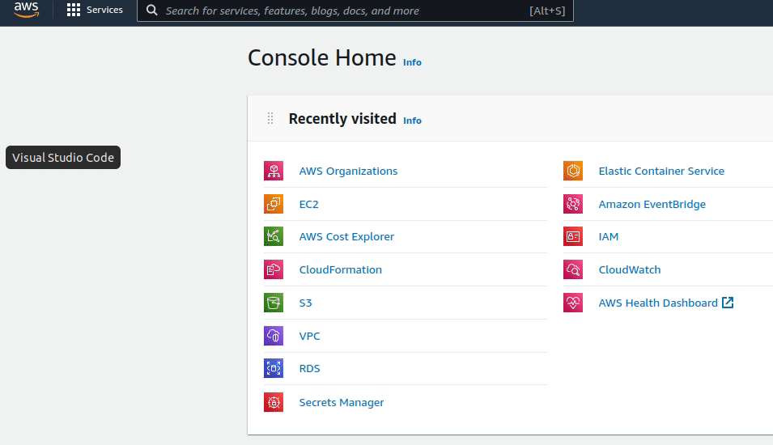

# Zanshin Automate AWS Onboarding 

This CloudFormation template creates the required resources to automatically onboard of your AWS Organization's Accounts to your Zanshin Organization.

## Overview

This will create an AWS ECS Fargate Task and an AWS EventBridge rule will be created to call this task given a cron expression you specify.

The task will:
- Download and install [Zanshin CLI](https://github.com/tenchi-security/zanshin-cli/)
- Make sure Zanshin CLI is working with your Zanshin API Key
- Onboard AWS Accounts to Zanshin Organization

## Pre-requisites

There're some steps required to successfully deploy the automation. 

1. Setup AWS Secrets Manager `secret` with Zanshin API Key
2. Choose VPC subnets that can reach the Internet
3. Privileges to deploy CloudFormation Stacks on AWS Management Account


### 1. Setup AWS Secrets Manager `secret` with Zanshin API Key

#### 1.1 Create Zanshin API Key

> :information_source: If you already have a **Zanshin API Key from your Zanshin Organization Admin**, skip to *[step 1.2](#12-setup-secret-on-aws-secrets-manager)*.

- Login to Zanshin with your Organization Admin user.
- On the top right, click on your profile photo or initials -> **Account Settings**. 
- Go to the **API Keys** tab, and **New API key**. Name it and copy it's value. 

#### 1.2 Setup Secret on AWS Secrets Manager

- On AWS Management Account, go to AWS Secrets Manager.
- On Secrets Manager, **Store a new Secret**.
  - Choose **Other type of secret**. Set the **key** to `api_key` and value to **your Zanshin API Key**.



> :information_source:
> Copy the `secret` ARN. It'll be used later.

### 2. Choose VPC subnets that can reach the Internet

This solution needs to download [Zanshin CLI](https://pypi.org/project/zanshincli/) from Python Package Index and communicates with Zanshin API on https://api.zanshin.tenchisecurity.com, so it needs to be deployed on a VPC and Subnets that can reach the public internet. If you require that traffic goes through a proxy, that can be configured via CloudFormation Parameters.

If you don't have an existing VPC, you can create one. The requirements are:
- One public and one private subnet, with an [Amazon VPC NAT Gateway](https://docs.aws.amazon.com/vpc/latest/userguide/vpc-nat-gateway.html) in order to traffic reach the internet

The CloudFormation stack will create a Security Group that don't allow inbound traffic, and only allow outbound traffic via HTTPS.


> :information_source: 
>  You must save for later:
> - VPC ID
> - Two Subnet ID's from the same VPC

### 3. Assign privileges to deploy CloudFormation Stacks on AWS Management Account

This solution must be deployed on AWS Organizations **[Management Account](https://docs.aws.amazon.com/organizations/latest/userguide/orgs_getting-started_concepts.html#account)**.

You must have write privileges to at least these services:
- [CloudFormation](https://docs.aws.amazon.com/AWSCloudFormation/latest/UserGuide/Welcome.html)
- [IAM Role](https://docs.aws.amazon.com/IAM/latest/UserGuide/id_roles.html)
- [IAM Policy](https://docs.aws.amazon.com/IAM/latest/UserGuide/access_policies.html)
- [ECS Clusters](https://docs.aws.amazon.com/AmazonECS/latest/developerguide/clusters.html)
- [ECS Task Definition](https://docs.aws.amazon.com/AmazonECS/latest/developerguide/task_definitions.html)
- [CloudWatch LogGroups](https://docs.aws.amazon.com/AmazonCloudWatch/latest/logs/Working-with-log-groups-and-streams.html)
- [EventBridge Rules](https://docs.aws.amazon.com/eventbridge/latest/userguide/eb-rules.html)
- [EC2 Security Group](https://docs.aws.amazon.com/AWSEC2/latest/UserGuide/ec2-security-groups.html)

Trying to deploy this solution with insufficient privileges will result in an inconsistent state of the CloudFormation Stack.

## Provide CloudFormation Stack Parameter Values

In order to deploy the CloudFormation stack, some parameters must be set.


#### **AWSExistingSubnet1Id**
The Subnet Id for the Zanshin Automate Task

#### **AWSExistingSubnet2Id**
The Subnet Id for the Zanshin Automate Task

#### **AWSExistingVPCId**
The VPC Id for the Zanshin Automate Task

#### **AwsOrganizationsId**
The ID of your AWS Organizations. See how to get that [here](#how-to-get-your-aws-organizations-id).

#### **MemberAccountsRoleName**
The name of the role which Zanshin will assume in Member accounts to perform onboard.
*Default `OrganizationAccountAccessRole`.* See how to find that [here](#how-to-find-memberaccountsrolename).

#### **ZanshinAutomationCronExpression**
Cron expression for the Automation Scheduler.
*Default value is `cron(0 12 * * ? *)`.*

#### **ZanshinAutomationExcludeAccounts**
AWS Accounts ID, Name or E-mail to ignore when performing Automate Onboard. Can be empty if onboarding all member accounts. To inform more than one account, separate them using comma. 
Ex: 
```
112233445566, Dev-TestAccount, 123456789012
```

#### **ZanshinAutomationHTTPSProxyURL**
HTTPS Proxy URL for Zanshin Automate Task. Can be empty if not using Proxy.

#### **ZanshinOnboardAwsRegion**
The name of the AWS Region you want Zanshin Onboard to deploy CloudFormation to.
*Default is `us-east-1`*

#### **ZanshinOrganizationUUID**
The UUID of the Zanshin Organization to onboard AWS Accounts to. How to get that [here](#how-to-get-your-zanshin-organization-uuid).

#### **ZanshinSecretArn**
The ARN of the Secrets Manager that contains the Zanshin API Key. This is the ARN you copied on [previous steps](#12-setup-secret-on-aws-secrets-manager).


## How to get parameter values?

Check below if you need help in order to fulfill the required parameters for deploying the CloudFormation template.

### How to get your Zanshin Organization UUID

First select the organization you want to obtain the ID from the dropdown at the navigation bar on Zanshin. In order to obtain your Zanshin Organization ID, goes to the settings page. On top you'll find the Organizationd Id field.


### How to get your AWS Organizations ID

You can retrieve your AWS Organizations ID either via AWS Console or using AWS CLI.

- Using AWS console 

1. Go to [AWS Organizations](https://us-east-1.console.aws.amazon.com/organizations/v2/home/)
2. Checkout the Organization ID on the left panel.


- Using AWS CLI

> :information_source: This assumes you've already installed and configure AWS CLI.
1. On your terminal, run `aws organizations describe-organization`.
2. Copy the `Id` value.

### How to find MemberAccountsRoleName

This parameter indicates the name of the role in AWS Member Accounts that will be assumed from AWS Management account. As a rule of thumb, if you enrolled all your AWS Member accounts on AWS Control Tower, this parameter must be set to `AWSControlTowerExecution` as this is the role Control Tower creates by default. If you do not enrolled control tower and uses only AWS Organizations, the value must be `OrganizationAccountAccessRole`.
If you created custom roles in member accounts that can be assumed from the management account and you wish to use them, use the custom role name.

> :warning: Note that this role must have at least the IAM privileges described [here](https://github.com/tenchi-security/zanshin-sdk-python/blob/main/zanshinsdk/docs/README.md#minimum-required-aws-iam-privileges).


## Deploying

After getting the value for all parameters, simply goes to AWS CloudFormation and deploy the stack.
After completion, all your AWS Member accounts will automatically be onboarded to the Zanshin Organization you informed (**ZanshinOrganizationUUID**), on the frequency you defined (**ZanshinAutomationCronExpression**), except the accounts you excluded (**ZanshinAutomationExcludeAccounts**).


### Logging

Execution Logs can be found at CloudWatch logs, on the region you deployed the CloudFormation. To locate the LogGroup, look for LogGroups that contains `zanshinautomatetaskdefinitionZanshinAutomateOnboardContainerLogGroup` on the name.

Logs can help you identify the number of accounts added and troubleshoot problems with your solution.

### FAQ
1. 
   - **Q.** Container fails to obtain Secret from Secrets Manager.
   - **A.** Check if the Subnet informed allows the container to make requests to the Internet or if using a VPC Endpoint to get Secrets, check its settings and policies.

2. 
   - **Q.** Container fails to download Zanshin CLI.
   - **A.** Check if the Subnet informed allows the container to make requests to the Internet.

3. 
   - **Q.** I want to onboard all member accounts except some specific accounts.
   - **A.** Add these account ID's or Name you want to not to automatically onboard on the **ZanshinAutomationExcludeAccounts** parameter.

4. 
   - **Q.** I want the onboard automation to run every X days/hours.
   - **A.** Change the **ZanshinAutomationCronExpression** parameter to make it suitable for your needs.

5. 
   - **Q.** I want to fetch secrets from AWS Secrets Manage via VPC Endpoint, not using AWS API.
   - **A.** Add a new VPC Endpoint for AWS Secrets Manager on the VPC that's being used to run the automation. Checkout [how to set it up](https://docs.aws.amazon.com/secretsmanager/latest/userguide/vpc-endpoint-overview.html).
6. 
   - **Q.** I want to limit the addresses that the automation solution can reach.
   - **A.** The solutions must be able to download Python packages from [PyPI](https://pypi.org/) and also reach [Zanshin's API](https://api.zanshin.tenchisecurity.com/). Set up a HTTPS Proxy that allows traffic at least to the following addresses on port 443:
     - https://api.zanshin.tenchisecurity.com/
     - https://pypi.org/